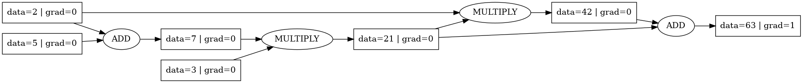
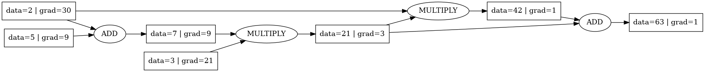
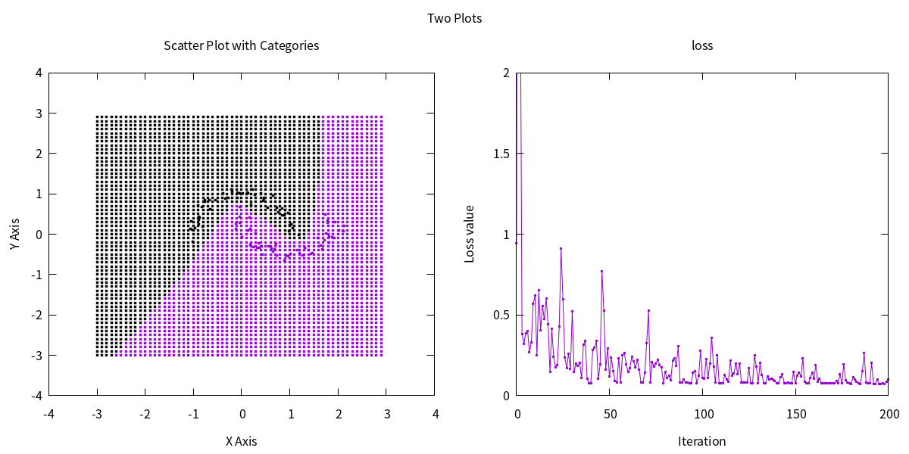

# Learn Micrograd [https://github.com/karpathy/micrograd]

Try to use *c++* to implement some fundamental features from Micrograd, train a simple Neural network to solve elementary binary classification problem, visualize the results.

## Features
- Feature 1: Implement core mathematical operations and derivation calculation.
- Feature 2: Implement neural network: compute Loss, calculate gradient, update parameters.
- Feature 3: Visualize the calculation graph and the result of binary classification.

## Dependencies
- _graphviz_ : to visualize calculation graph.
- _gnuplot_ : to visualize binary classification result. [program exports all classify result from neural network into a file, and visualize it by _gnuplot_]

## Build
- step 1: `cmake -S \$\{workspaceFolder\} -B \${workspaceFolder}/build -DCMAKE_BUILD_TYPE=Debug `
- step 2: `cmake --build ${workspaceFolder}/build --target all --config Debug `

## Example usage
Below is a simple example showing a number of possible supported operations and how to draw calculation graph.
```
#include "test_ground.h"

ValuePtr a = std::make_shared<Value>(5);
ValuePtr b = std::make_shared<Value>(2);
ValuePtr c = a + b;
ValuePtr d = std::make_shared<Value>(3);
ValuePtr e = c * d;
ValuePtr f = b * e;
ValuePtr h = f + e;

h->derivative = 1;

GVC_t* gvc = gvContext();
drawGraph(h, "../autograd", gvc); # draw calculation graph [derivates are zero]
backward(h);                      # solve derivate
drawGraph(h, "../backward", gvc); # draw again 
```



## Training a neural network and visualize binary classification result

- The `testNN()` function in `test_ground.h` provides a full demo of training a neural network binary classifer.
- run command `gnuplot draw.gp` to draw.
